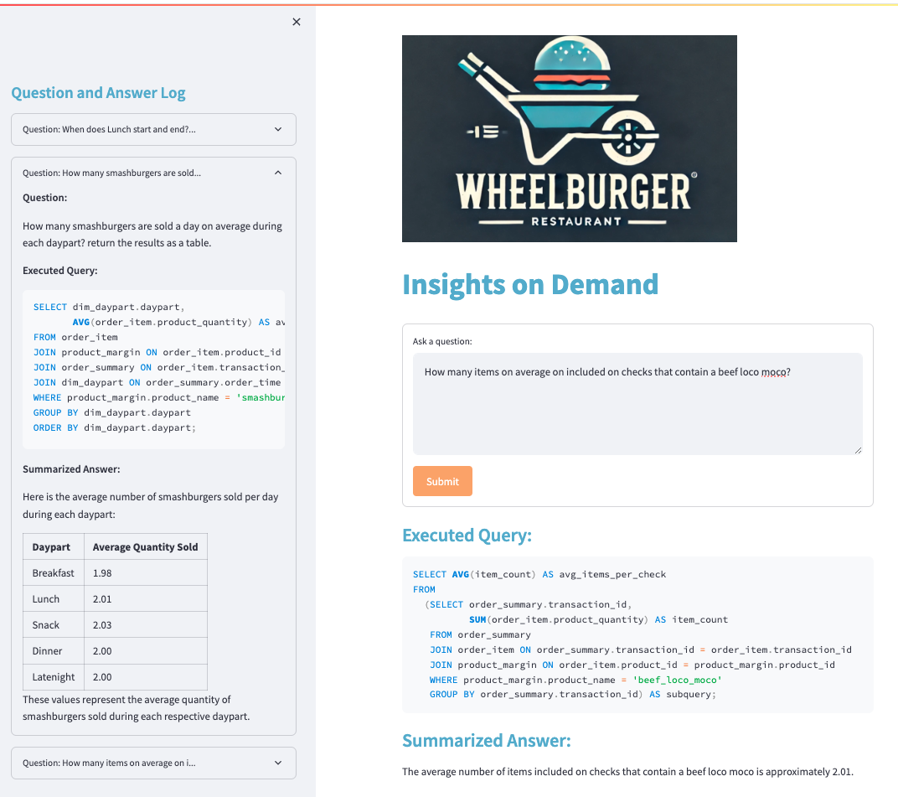

# Insights on Demand - Text to SQL Chatbot

This repository contains the code for a chatbot developed for a generic restaurant. The chatbot is designed to take a text prompt, generate a SQL query, return raw output, and summarize the response. This is a low-code solution with minimal tooling for out of the box usage. The data is entirely synthetic.

## Usage

To use the app, make sure dependencies are resolved (see requirements), navigate to your local project folder, and run these two commands in terminal window:
```terminal
> conda activate sql_qna
> python -m streamlit run app.py
```




The first time using, you will need to create the database using the `create_db` notebook. You will also need your own OpenAI keys stored in a .env file in root directory.

## Environment and Dependencies
- All modules created in `python=3.11.7`
- open terminal window and clone the repository (git clone ...url)
- open a terminal window in the repository folder
- to create a virtual environment and install the required packages with necessary dependencies, run the following commands in terminal:

```python
> conda create -n sql_qna python=3.11.7
> conda activate sql_qna
> conda -y install jupyter jupyterlab ipykernel
> python -m ipykernel install --user --name=sql_qna
> # you may need to restart the environment to use it in jupyter lab
> conda deactivate
> conda activate sql_qna
> pip install -r requirements.txt
```